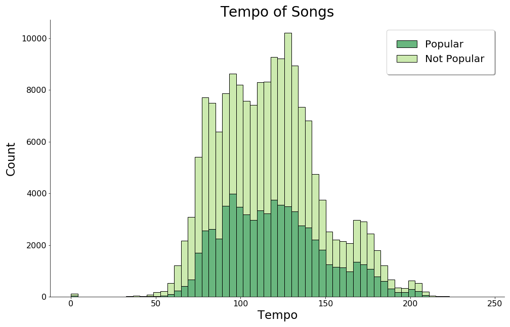
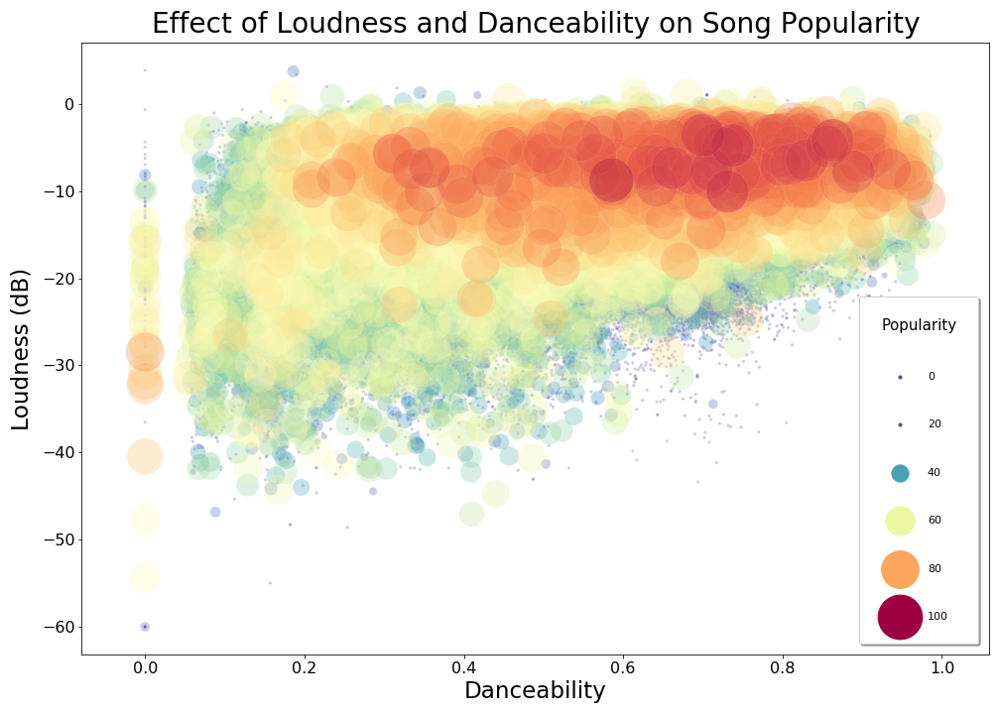

# Predicting the Popularity of Songs on Spotify
**Author:** Shawn Samuel

## Overview

The music industry is driven by the popularity of particular songs and Spotify is at the center of driving that success. In this project I use machine learning to determine whether or not a song will be popular on Spotify's platform. The business use case of this tool would be for a record label to decide if a song has the right mix of musical attributes to warrent marketing and distribution dollars to be put behind it. The data is obtained through Spotify's API and available on Kaggle. Our business case lends itself to optomizing on the Precision Score and we will test several major machine learning models utizling pipelines and grid searches. The Random Forest model had the highest Precision Score of 73% without overfitting and further optomizing options are available.

## Business Problem

There are a lot of songs on Spotify. To the tune of [70 million tracks](https://newsroom.spotify.com/company-info/) as of December 2020 with an average of 60,000 songs being added every day. There are many variables that determine which songs out of this massive library to become popular. Considering that the worlds largest 4 music lables own [87% of the content on Spotify](https://www.thelocal.se/20180302/the-story-of-spotify-swedens-controversial-king-of-music-streaming/), what drives the popularity of a particular song is of great interest to these entities. Our goal with this project is to build a machine learning model that can predict whether a song will be popular or not based on a set of features. The popularity of the song will be based on Spotify's own proprietry ranking. This will allow record labels to determine which songs are worth putting more marketing dollars behind. 

When making decisions regarding which models and metrics to use, it is always important to determine which errors will be more costly. For our particularl case - there are the ramifications of errors:  
- **Type I Error (FP)** = predicting a song *will* be popular when it *will not*  
- **Type II Error (FN)** = predicting a song *will not* be popular when it *will*  

In this particular business case - if a song is predicted to be positive, I would recommend a record label put marketing dollars behind that song to generate more plays and more profit. A *Type I Error* would cause money to be lost up front. This would mean increased cost and also less profit - leaving the record label in the red. A *Type II Error* on the other hand, would be a loss of potential profit due to the lost opportunity of a popular song. With that in mind we would emphasis the **Precision** score as our primary metric to minimize *False Positives*. We will also consider the **F1 Score** to give us a balance of Type I and Type II errors. 

## Data Understanding

The [spotify data set](data/spotify_data.csv) was obtained from [Kaggle](https://www.kaggle.com/yamaerenay/spotify-dataset-19212020-160k-tracks) and contains audio features of 175k+ songs released in between 1921 and 2021. The features are described below:

Numerical:
- **acousticness** (Ranges from 0 to 1) - *The relative metric of the track being acoustic*
- **danceability** (Ranges from 0 to 1) - *The relative measurement of the track being danceable*
- **energy** (Ranges from 0 to 1) - *The energy of the track*
- **duration_ms** (Integer typically ranging from 200k to 300k) - *The length of the track in milliseconds (ms)*
- **id** (Alphanumeric) - *The primary identifier for the track, generated by Spotify*
- **instrumentalness** (Ranges from 0 to 1) - *The relative ratio of the track being instrumental
- **valence** (Ranges from 0 to 1) - *The positiveness of the track*
- **popularity** (Ranges from 0 to 100) - *The popularity of the song lately, default country = US*
- **tempo** (Float typically ranging from 50 to 150) - *The tempo of the track in Beat Per Minute (BPM)*
- **liveness** (Ranges from 0 to 1) - *The relative duration of the track sounding as a live performance*
- **loudness** (Float typically ranging from -60 to 0) - *Relative loudness of the track in decibel (dB)*
- **speechiness** (Ranges from 0 to 1) - *The relative length of the track containing any kind of human voice*
- **year** (Ranges from 1921 to 2020) - *The release year of track*  

Binary:
- **mode** (0 = Minor, 1 = Major) - *Whether the track starts with a major chord progression or not*
- **explicit** (0 = No explicit content, 1 = Explicit content) - *Whether the track contains explicit content or not*

Categorical:
- **key** - *All keys on octave encoded as values ranging from 0 to 11, starting on C as 0, C# as 1 and so on…)*
- **artists** - *The list of artists credited for production of the track*
- **release_date** - *Date of release mostly in yyyy-mm-dd format, however precision of date may vary)*
- **name** - *Title of the song*

## Methods

First we explored the relevant features and created visualizations to gain an understanding of the data. Below you can see some of the visualizations generated from data exploration:  

### Distribution of Song Energy Dilineated by Popularity 


### Distribution of Song Tempos Dilineated by Popularity 



After analyzing the target column, I decided to set the popularity of .3 as the cutoff to create a binary feature called "popular". The imbalance was as follows:

| 1 (Popular) | 0.394796 |
|-----------------|----------|
|   0 (Not Popular)   | 0.605204 |

Below is a graph representing the distribution of the popular vs. not popular classes on the original continuous popularity percentage:

  

Several irrelvant features were dropped and an initial baseline Logistic Regression regression was built. After that several models with built utilizing pipelines and grid search. The results are presentet below in reverse sequential order:

| **Seq** |                    **Model** | **Precision** | **F1 Score** | **Roc-Auc** |
|----:|-------------------------:|----------:|---------:|---------|
|   9 |                  XGBoost |    68.48% |   67.20% |  73.11% |
|   8 |        Gradient Boosting |    68.66% |   67.31% |  73.21% |
|   7 | GridSearch Random Forest |    73.02% |   32.25% |  57.86% |
|   6 |            Random Forest |    72.09% |   45.19% |  62.31% |
|   5 | GridSearch Decision Tree |    68.55% |   51.48% |  64.45% |
|   4 |      Tuned Decision Tree |    68.55% |   51.48% |  64.45% |
|   3 |    Vanilla Decision Tree |    60.48% |   60.14% |  67.19% |
|   2 |        GridSearch LogReg |    65.88% |   62.15% |  69.50% |
|   1 |          Balanced LogReg |    60.61% |   66.56% |  71.30% |
|   0 |          Baseline LogReg |    65.87% |   62.18% |  69.51% |
   
## Recommendations

We set out to build a model that would predict what songs would be popular as precisely as possible. Of the 10 major models we built and many iterations that we tested, the one that performed the highest on the precision score was the Random Forest. It had a precsion score of 73.02% and was slightly underfit on the validation set. We recommend optimizing this model further. Though this model sacrifices quite a bit in terms of False Negatives (the F1 score is 32%) it minimizes False Positives by design. This is important to us to minimize the cost based on our business undersstanding and application of this model. 

There are also some interesting features of this model that could contribute to optomized song creation. This model determined that danceability, loudness and energy were the top contributing features towards determining the popularity of songs on Spotify. This could be included by the record label when evaluating songs. Below is a visualization of two of the top features (danceablity and loudness) in relation to song popularity. Visually, we can see the importance of these features in popularity:

  

## Future Work

I suggest further optomizing the model. Some potential areas include:

- 1) Finding out what the effect of the release date is. The date could be engineered to determine the month, week number or even generally the season that a song was released.
- 2) The XGBoost model has great potential in providing a balanced F1 score to minimize the lost opportunity of False Negatives.  
- 3) This data set could be paired with a lyrics data set to determine the impact of lyrics on popularity of songs

## For More Information

Please review the full analysis in the [Jupyter Notebook](project-notebook.ipynb) or the [presentation](project-presentation.pdf).

For additional info, contact Shawn Samuel at [shawnjohnsamuel@gmail.com](mailto:shawnjohnsamuel@gmail.com)

## Repository Structure

```
├── data
├── images
├── README.md
├── project-notebook.ipynb
├── project-presentation.pdf
└── sjs_utilities.py
```
